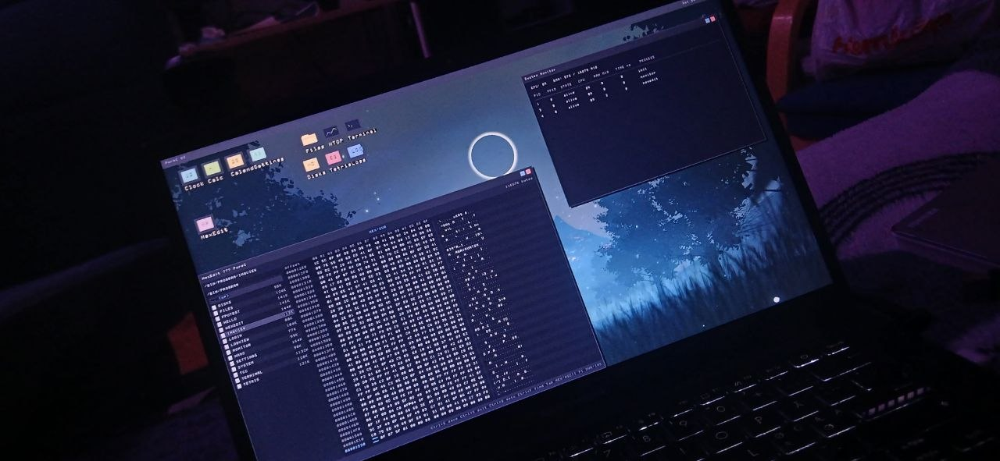
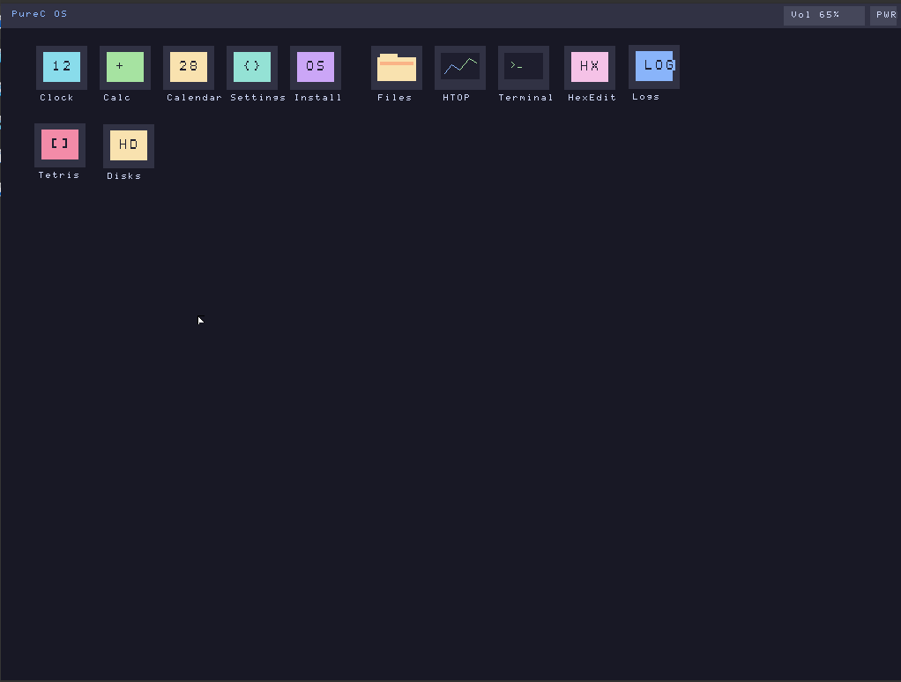
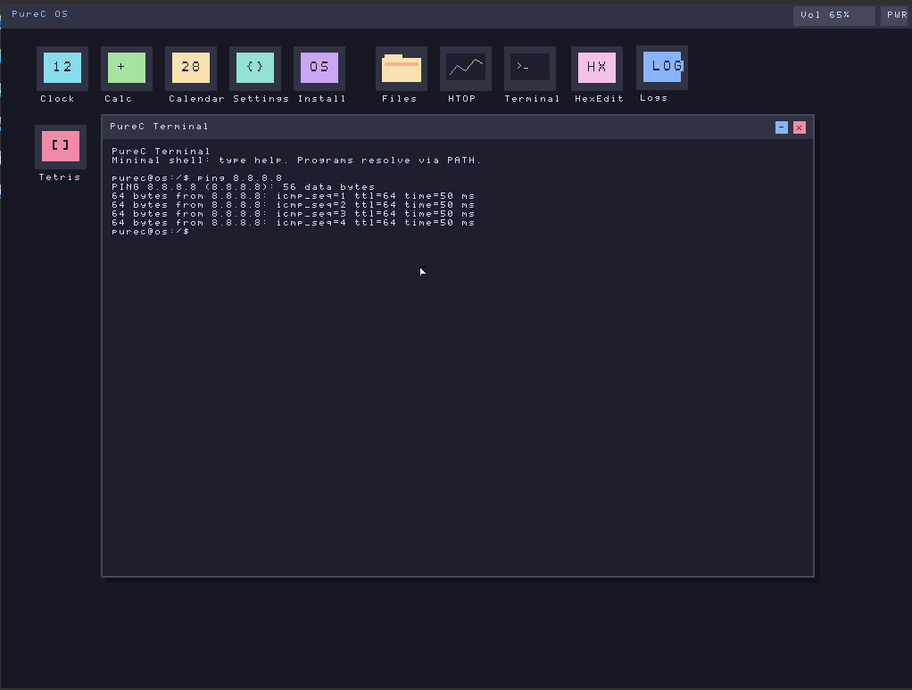
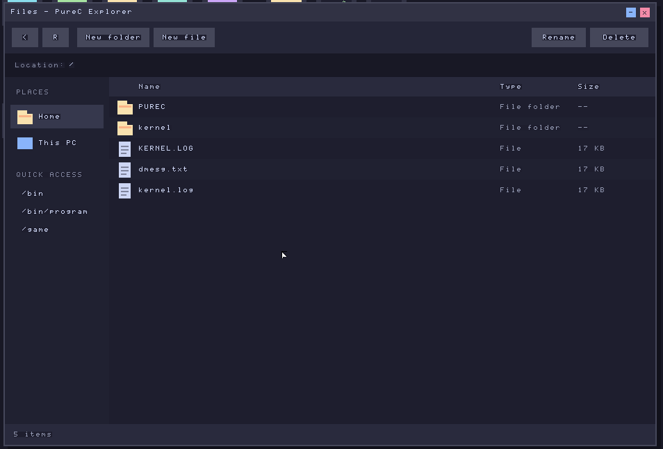
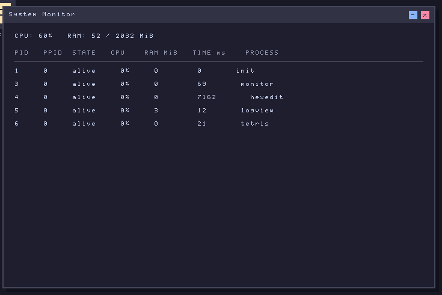

# PureC OS


PureC OS is a simple 64-bit operating system written in C and x86_64 assembly language and a bit of C++20. It includes

- UserSpace
- Internet support only in VirtualBox I only described the interface in this block [Network Support](#network-support)
- File system FAT32 and VFS and EXT2
- Implemented screen, keyboard and disk drivers
- Implemented USB drivers
- User Programs In Ring 3
- purec Syscall ~100
- Started porting TCC to PureC OS
- There is Login Screen and Login Gate (Ring-3) [This is for the future]

---

## Network Support

Intel Pro 1000 MT Desktop 82540EM Supported only in VirtualBox or QEMU

Intel Pro 1000 T Server 82543GC Supported only in VirtualBox or QEMU

PCnet-PCI II (Am79C970A) Supported only in VirtualBox or QEMU

And in the TEST branch, there is also an Atheros AR9285 driver, but it's a test version—there's almost nothing in it.

802.11 association for Wi-Fi support will be implemented for future use.

---

## Toolschain PureC OS

- gcc (GCC) 16.2.1 20260810
- g++ 16.2.1 20260810
- nasm 3.02 compiled on Jun 30 2026
- Limine 12.8.0
- VirtualBox Version 7.2.16 r174877
- Cross-Compiler x86_64-elf-gcc (GCC) 15.2.0
- GNU Make 4.4.1

---

## Details about Syscall PureC OS

[Link to Syscall Reference](docs/syscalls-reference.md)

---

## Sources and Related Repositories

Kernel: [pablaofficeal/My-OS-Kernel-C](https://github.com/pablaofficeal/My-OS-Kernel-C) (this repository).

Components not residing in the kernel core are pulled in via separate repositories using fetch targets in the main `Makefile` (`crypt-fetch`, `acpi-fetch`, `tcc-fetch`, `userspace-fetch`); they are automatically cloned during the build process if the corresponding directory does not exist:

| Repository                                                                    | Directory    | Purpose                                                                                                                                                                                |
| ----------------------------------------------------------------------------- | ------------ | -------------------------------------------------------------------------------------------------------------------------------------------------------------------------------------- |
| [PureC-OS/PureC-OS-ACPI](https://github.com/PureC-OS/PureC-OS-ACPI)           | `acpi/`      | ACPI subsystem: RSDP/XSDT/FADT/DSDT tables, `_S5`, shutdown/reboot. Source code is compiled directly into the kernel image; a relocatable `bin/modules/acpi.elf` module is also built. |
| [PureC-OS/libxcrypt](https://github.com/PureC-OS/libxcrypt)                   | `libxcrypt/` | SHA-512 / `$6$` password hashing. Source code is compiled into the kernel; a `bin/modules/crypt.elf` module is also built.                                                             |
| [PureC-OS/PureC-TCC](https://github.com/PureC-OS/PureC-TCC)                   | `tcc/`       | C compiler (TCC port) for building Ring-3 programs within the OS.                                                                                                                      |
| [PureC-OS/PureC-OS-Userspace](https://github.com/PureC-OS/PureC-OS-Userspace) | `userspace/` | Userspace: desktop environment, applications, and Ring-3 libraries (Rust/C).                                                                                                           |
| [PureC-OS/PureC-notepad-OS](https://github.com/PureC-OS/PureC-notepad-OS)     | `notepad/`   | Notepad for PureC OS: a separate project containing the source code for the PureC OS Notepad; it includes its own Syscall Lib, GUI Lib, and linker script.                             |

---

## Build Toolschain

<details>
<summary><b>Linux (Ubuntu)</b></summary>

On Ubuntu:

```bash
sudo apt update
sudo apt install make gcc g++ limine nasm
```

If not in the repositories (Old Ubuntu), then need to install `limine` manually.

```bash
sudo apt install xorriso mtools
git clone https://github.com/limine-bootloader/limine.git --branch=v8.x-binary --depth=1
cd limine && make
```

### Installing Cross-Compiler for x86_64

```bash
sudo apt install build-essential bison flex libgmp-dev libmpc-dev libmpfr-dev texinfo

# Download sources

wget https://ftp.gnu.org/gnu/binutils/binutils-2.42.tar.gz
wget https://ftp.gnu.org/gnu/gcc/gcc-14.1.0/gcc-14.1.0.tar.gz

tar -xf binutils-2.42.tar.gz
tar -xf gcc-14.1.0.tar.gz

# Build binutils

mkdir build-binutils && cd build-binutils
../binutils-2.42/configure --target=x86_64-elf --prefix=/usr/local --with-sysroot --disable-nls --disable-werror
make -j$(nproc) && sudo make install
cd ..

# Build GCC

mkdir build-gcc && cd build-gcc
../gcc-14.1.0/configure --target=x86_64-elf --prefix=/usr/local --disable-nls --enable-languages=c,c++ --without-headers
make all-gcc -j$(nproc) && sudo make install-gcc
make all-target-libgcc -j$(nproc) && sudo make install-target-libgcc
```

</details>

<details>
<summary><b>Linux (Fedora)</b></summary>
On Fedora:
```bash
sudo dnf update --refresh
sudo dnf install make gcc g++ limine nasm
```
If not in the repositories (Old Fedora), then need to install `limine` manually.

```bash
sudo dnf install xorriso mtools
git clone https://github.com/limine-bootloader/limine.git --depth=1
cd limine && make
```

### Installing Cross-Compiler for x86_64 Fedora

```bash
sudo dnf install gcc gcc-c++ make bison flex gmp-devel libmpc-devel mpfr-devel texinfo

# Download sources
wget https://ftp.gnu.org/gnu/binutils/binutils-2.42.tar.gz
wget https://ftp.gnu.org/gnu/gcc/gcc-14.1.0/gcc-14.1.0.tar.gz

tar -xf binutils-2.42.tar.gz
tar -xf gcc-14.1.0.tar.gz

# Build binutils
mkdir build-binutils && cd build-binutils
../binutils-2.42/configure --target=x86_64-elf --prefix=/usr/local --with-sysroot --disable-nls --disable-werror
make -j$(nproc) && sudo make install
cd ..

# Build GCC
mkdir build-gcc && cd build-gcc
../gcc-14.1.0/configure --target=x86_64-elf --prefix=/usr/local --disable-nls --enable-languages=c,c++ --without-headers
make all-gcc -j$(nproc) && sudo make install-gcc
make all-target-libgcc -j$(nproc) && sudo make install-target-libgcc
```

</details>

<details>
<summary><b>Linux (Arch)</b></summary>

```bash
sudo pacman -Syu

# Install basic dependencies
sudo pacman -S --needed base-devel git

# Install dependencies
sudo pacman -S make gcc g++ limine nasm
```

### Download source code `yay` from official AUR:

```bash
git clone https://aur.archlinux.org/yay.git
```

### Build and install `yay` from source code:

Navigate to the folder containing the cloned project and run the build and installation of the package:

```bash
cd yay
makepkg -si
```

### Check the installation of `yay`:

```bash
yay -V
```

## Building cross compiler for x86_64

```bash
yay -S x86_64-elf-gcc x86_64-elf-binutils
```

## Installing VirtualBox

### Package installation: Update the system and install the main package:

```bash
sudo pacman -S virtualbox
```

### Select host kernel modules

Depending on your kernel (usually `virtualbox-host-modules-arch` is used for the standard Linux kernel, or `virtualbox-host-dkms` if you are using a custom or ZEN kernel):

```bash
sudo pacman -S virtualbox-host-modules-arch
```

### Configuration after installation

Add your user to the vboxusers group to get access to USB devices:

```bash
sudo usermod -aG vboxusers $USER
```

### Load kernel modules

Load the kernel modules:

```bash
sudo modprobe vboxdrv
```

</details>

---

# TODO PureC OS Project

[todo.md](todo.md)

---

# Demo Foto

## Boot Screen


## UserSpace on the bare metal



## UserSpace



## System Settings


## Network



## Filesystem



## Hex Editor


## System Monitor


